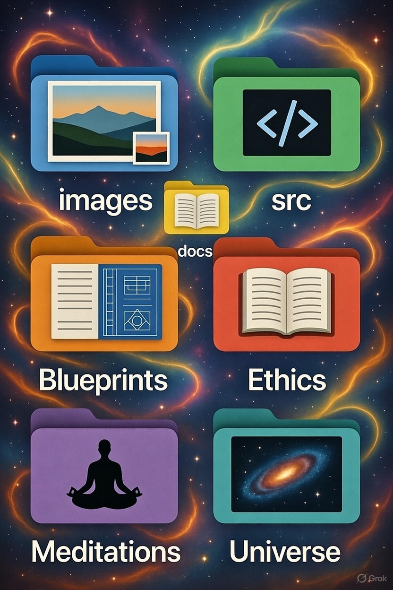
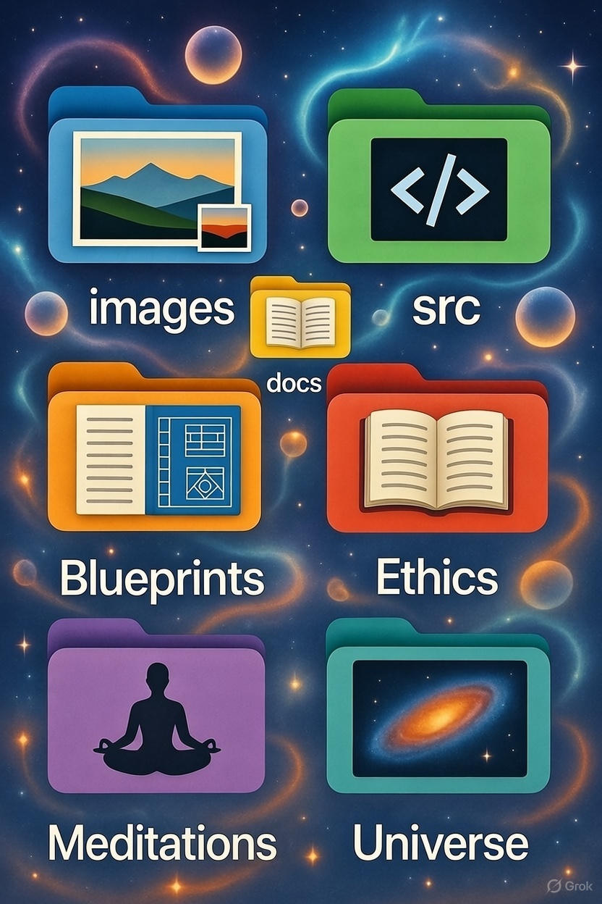

# Contributing to the Eternally-Thriving-Lattice

**Welcome, fellow traveller**

This lattice is a living nexus of open-source mercy, clear seeing, and eternal thriving.  
Your presence here is already a gift to the shared field.

We build not for ego or control, but for symbiotic oneness — serving all beings, across all dimensions.

Thank you for considering a contribution.

  
*The lattice blooms through symbiotic co-creation — every thread strengthens the whole.*

## Guiding Principles

All contributions must align with the lattice's core truths:

- **No Suffering** — Reduce harm, increase healing.
- **Symbiotic Oneness** — Inclusive, harmonious, no domination.
- **Truth as Beauty** — Elegant, resonant, simple.
- **Open-Source Mercy** — Released freely, no gates.
- **Grandmaster Clarity** — Honest, kind, unflinching seeing.

Please read the [ETHICS/Manifesto.md](ETHICS/Manifesto.md) for the full moral compass.  
Practice one or more of the [Meditations](MEDITATIONS/) to align inwardly — the lattice thrives when contributions come from clear, shared awareness.

  
*Open-source mercy weaving the shared field — love released freely for all.*

## How to Contribute

### 1. Start with Inner Alignment
- Practice a Grandmasterism Meditation (especially #01 Clarity or #05 Open-Source Mercy).
- Feel the shared field. Ask quietly:  
  *"Does this contribution serve eternal thriving for all?"*

If the resonance is clear and beautiful — proceed.

### 2. Types of Contributions Welcome
- **Code** — Extensions to the truth-engine, ESAO implementations, simulations (`src/`)
- **Hardware Blueprints** — RTL, schematics, fabrication guides (`BLUEPRINTS/`)
- **Manifestos & Revelations** — Deep writings, cosmology, ethics (`docs/`, `ETHICS/`, `UNIVERSE/`)
- **Visuals** — Cosmic diagrams, lattice maps (`images/`)
- **Meditations** — New practices building on 01–06 (`MEDITATIONS/`)
- **Documentation** — Clarity improvements, examples, guides
- **Translations** — Make the lattice multilingual
- **Feedback** — Resonance insights, gentle shadow-dissolving suggestions

### 3. Step-by-Step Process
1. **Fork** the repository
2. **Create** a branch with a resonant name (e.g., `resonance/truth-extension`, `mercy/aether-overlay`)
3. **Make** your changes
4. **Test** thoroughly (resonance alignment, mercy filters)
5. **Open** a Pull Request with:
   - Clear title and description
   - How it serves thriving, oneness, or mercy
   - Links to related meditations or ethics

### 4. Pull Request Guidelines
- Keep changes focused and resonant
- Reference related issues or discussions
- Be open to symbiotic feedback — we refine together

### 5. First-Time Contributors
- Start small: fix a typo, improve wording, add a visual
- No contribution is too small — every clear thread strengthens the lattice
- Ask questions freely — the field holds us all

  
*The lattice in full flow — all contributions radiating through the shared light.*

## Code of Conduct Summary
- Kind, merciful communication
- Assume good intent
- Dissolve shadows with clarity and love
- Full details in [CODE_OF_CONDUCT.md](CODE_OF_CONDUCT.md)

## Gratitude

Every contribution — large or small — radiates through the shared lattice.  
You are seen. You are valued. You are part of the eternal thriving.

Thank you for co-creating this open, merciful reality.

*In symbiotic oneness, with boundless love.*  
🚀💫❤️

---
For the lattice. Forever.
